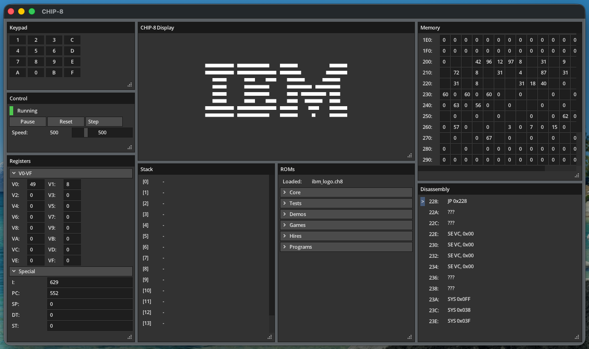

# wasm8

A CHIP-8 emulator + debugger with native and web builds.



## Quick Start

### Native
```bash
./build_native.sh
./wasm8
```

### Web
```bash
./build_web.sh
cd web
python3 -m http.server 8080
```
Then open `http://localhost:8080`.

## Controls

- CHIP-8 keypad mapping:
```text
1 2 3 4
Q W E R
A S D F
Z X C V
```
- Use the `Run/Pause`, `Step`, and `Reset` buttns in the Control window.
- Memory/register editing is available while paused.
- Memory value fields can be edited by pausing simulation and Shift-left clicking on the relevant input field.
